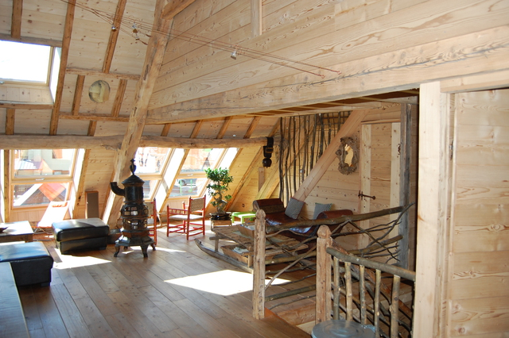
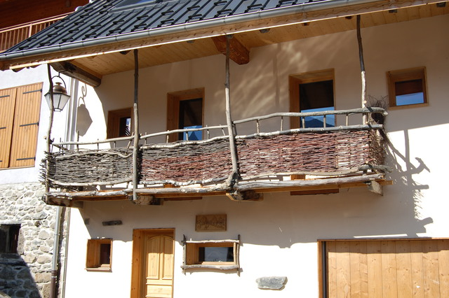
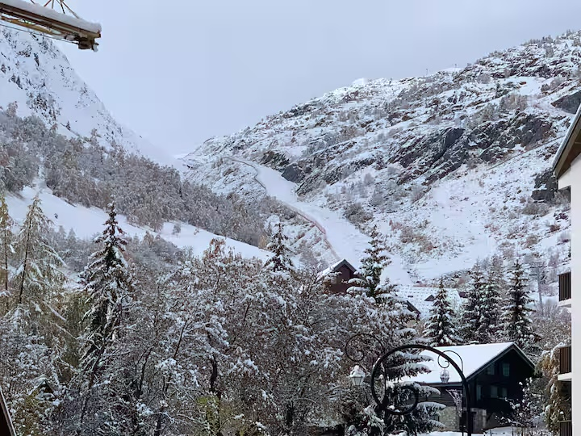
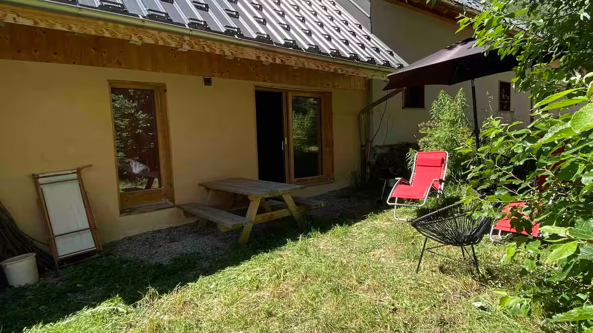

# Chalet Jostedalen — Location à Saint-Sorlin d'Arves (Savoie)

Chalet triplex très grand confort de **240 m²** avec **6 chambres**, **jacuzzi** privatif et **garage**, pour **8 à 15 personnes**. Situé au pied du domaine skiable **Les Sybelles** (310 km de pistes, 4ème domaine de France), à **Saint-Sorlin d'Arves** (1 600 m), en Savoie.

**[Voir le site et les tarifs](https://www.location-chalet-jostedalen.com/)**

---

## Le chalet

Le Chalet Jostedalen est un **triplex indépendant** orienté sud, avec vue sur les pistes et la montagne. Il offre de grands espaces de vie sur 3 niveaux :

- 6 chambres fermées (dont 2 sous les toits)
- 2 pièces à vivre (salon TV/enfants + grand salon sous charpente)
- 1 salle détente avec spa/jacuzzi 6/7 places
- 5 douches, 5 WC dont 3 indépendants
- 1 grand sas d'entrée
- Garage privé pour 1 voiture

> [Voir les plans et photos du chalet](https://www.location-chalet-jostedalen.com/#chalet)

## Équipements

**Cuisine** : plaque vitrocéramique, four, micro-ondes, réfrigérateur & congélateur, lave-vaisselle, 2 appareils à raclette, 2 appareils à fondue, cafetière à grains et filtre, robot ménager, presse-orange électrique.

**Multimédia & linge** : WiFi, téléphone, enceinte Bluetooth AirPlay, télévision, lave-linge, sèche-linge, fer & table à repasser, 1 couette par couchage.

**Bébés** : chaise haute & table à langer, 2 lits parapluies avec matelas, protection escalier, baignoire plastique.

> [Liste complète des équipements](https://www.location-chalet-jostedalen.com/#equipements)

## Hiver — Ski au pied des pistes

Le chalet se trouve à **200 m des pistes** du domaine **Les Sybelles**, qui offre 310 km de pistes reliées entre 6 stations. Une **navette gratuite** s'arrête à 30 m du chalet. Le magasin de location de ski Skiset est mitoyen au chalet.

Après le ski : détente au **jacuzzi privatif**, raclette ou fondue pour tout le groupe.

## Été — Randonnée et activités de plein air

En été, Saint-Sorlin d'Arves offre un cadre idéal pour les activités de montagne : **randonnée**, escalade, équitation, via-ferrata, parapente. Un **plan d'eau surveillé** se trouve à 200 m, et le chalet dispose d'un **jardin** avec table et barbecue.

## Borne de recharge véhicule électrique

Le chalet est équipé d'une **borne de recharge de 22 kW**, disponible pendant les heures creuses.

## Avis clients — 4.9/5

Le chalet est noté **4.9/5** sur la base de **37 avis vérifiés** sur Airbnb.

> *« Parfait pour 12 personnes, grande surface avec nombreuses SDB et WC. Très bien équipé, jacuzzi. Accueil sympa. »*

> *« Triplex spacieux et lumineux. Jacuzzi après la rando. Bon accueil. »*

> *« Très bien situé, tout à pied. Bien équipé et joliment décoré. On reviendra ! »*

[Voir tous les avis sur le site](https://www.location-chalet-jostedalen.com/#avis)

## FAQ

45 questions fréquentes avec réponses détaillées : réservation, tarifs, linge, arrivée/départ, équipements, parking, règlement intérieur, taxe de séjour, accès aux pistes.

> [Consulter la FAQ complète](https://www.location-chalet-jostedalen.com/#faq)

## Tarifs et disponibilités

Location à la semaine (samedi au samedi) en haute saison. Week-end possible au printemps et à l'automne. Ménage de fin de séjour inclus.

> [Voir les tarifs et le calendrier](https://www.location-chalet-jostedalen.com/#tarifs)

## Réserver / Contact

- [Contacter par WhatsApp](https://www.location-chalet-jostedalen.com/#contact)
- [Contacter par iMessage / SMS](https://www.location-chalet-jostedalen.com/#contact)

## Suivez-nous

- [Facebook](https://www.facebook.com/ChaletJostedalen/)
- [Instagram](https://www.instagram.com/chaletjostedalen/)

---

Site disponible en 5 langues :
[Français](https://www.location-chalet-jostedalen.com/) · [English](https://www.location-chalet-jostedalen.com/en/) · [Nederlands](https://www.location-chalet-jostedalen.com/nl/) · [Deutsch](https://www.location-chalet-jostedalen.com/de/) · [Italiano](https://www.location-chalet-jostedalen.com/it/)
